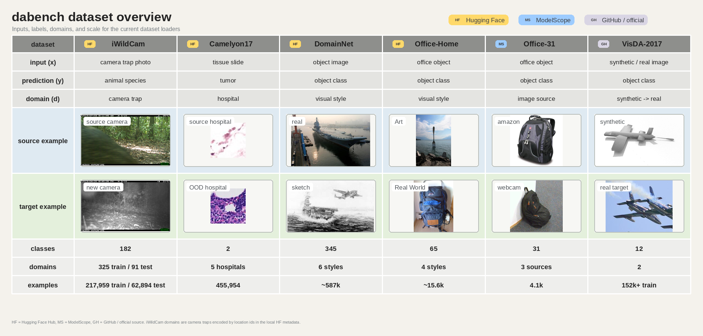

# dabench

[](https://wonder-if.github.io/domain-adaptation-benchmark/)
[](pyproject.toml)

Lightweight dataset utilities for domain adaptation research.

`dabench` focuses on explicit dataset preparation, dataset-specific loading, and experiment suite assembly. It keeps data preparation explicit and returns Hugging Face `datasets.Dataset` objects where possible, so the same datasets can be used with PyTorch, `transformers`, or custom research code.



## Getting Started

```bash
git clone https://github.com/wonder-if/domain-adaptation-benchmark.git
cd domain-adaptation-benchmark
pip install -e .[data]
```

Load a prepared local dataset, or load a single domain/split view:

```python
from dabench.data import load_view

domainnet = load_view("domainnet", domain="clipart", split="train", format="hf")
office_home = load_view("office-home", domain="Art", format="hf")
office31 = load_view("office-31", domain="amazon", format="torch")
visda = load_view("visda-2017", domain="synthetic", split="train", format="hf")
minidomainnet = load_view("minidomainnet", domain="clipart", split="train", format="hf")
camelyon17 = load_view("camelyon17", split="ood_val", format="hf")
iwildcam = load_view("iwildcam", split="train", format="hf")
```

Load cached CLIP features explicitly when you want to skip repeated image-model inference:

```python
from dabench.data import list_feature_caches, load_feature_decode_errors, load_text_features, load_view

features = load_view(
    "office-31",
    domain="amazon",
    format="feature",
    feature_model="clip-vit-base-patch16",
)
text_features = load_text_features(
    "office-31",
    domain="amazon",
    feature_model="clip-vit-base-patch16",
    prompt="a photo of a {CLASS}.",
)

wilds_features = load_view(
    "iwildcam",
    split="train",
    format="feature",
    feature_model="clip-vit-l-14-datacomp.xl-s13b-b90k",
)
mini_features = load_view(
    "minidomainnet",
    domain="clipart",
    split="train",
    format="feature",
    feature_model="clip-vit-base-patch16",
)
print(list_feature_caches("iwildcam", include_stats=True))
print(load_feature_decode_errors("iwildcam", split="train", feature_model="clip-vit-base-patch16")[:1])
```

The current feature cache layout covers `office-31`, `office-home`, `domainnet`,
`minidomainnet`, `camelyon17`, and `iwildcam`. `minidomainnet` is a derived view:
it reads image and text features from the full `domainnet` cache, then filters
image features with the configured mini split files. Labels and text features are
remapped to the prepared DomainNet class order used by `load_view`.

For WILDS datasets, cached features use the split name where domain-based datasets
use the domain name. Generate them through dabench loaders with:

```bash
PYTHONPATH=src python scripts/extract_wilds_clip_features.py \
  --datasets camelyon17 iwildcam \
  --models clip-vit-base-patch16 clip-vit-l-14-datacomp.xl-s13b-b90k
```

iWildCam labels and class names are joined from the configured WILDS metadata
JSON files in the dabench path config; the prepared Arrow directory itself only
stores image rows. A small number of iWildCam JPEGs are not decodable; feature
extraction skips those rows and saves their metadata in `decode_errors.json`.

Load local pretrained models from the configured model root when you need a backbone:

```bash
pip install -e ".[models]"
```

```python
from dabench.models import load_model

bundle = load_model("clip-vit-base-patch16")
model = bundle.model
processor = bundle.processor
tokenizer = bundle.tokenizer
```

The model layer only resolves and instantiates local pretrained models. It does
not include adaptation algorithms, trainable prompts, LoRA modules, or training
heads.

Download data explicitly when needed:

```python
from dabench.storage import download_dataset

download_dataset(
    "office-home",
    dest="/path/to/office_home_prepared",
    source="mirror",
    proxy="disable",
)
```

For Hugging Face-backed datasets, `source="mirror"` uses `https://hf-mirror.com`; `source="hf"` uses the official Hugging Face endpoint.

`minidomainnet` reuses prepared `domainnet` data and filters it using configured split files. Configure both the prepared dataset `path` and the `split_dir` in `src/dabench/config/paths.json` (or your overridden dabench path config).

Build and execute UDA suites:

```python
from dabench.suite import build_suites, load_suite_item

suite = build_suites(datasets="domainnet", setting="uda", format="hf")[0]
item = suite["settings"][0]
train_loader, val_loader, test_loader = load_suite_item(item)
```

For cached feature experiments, pass `format="feature"` and provide the cached feature model through `dataset_defaults`:

```python
suite = build_suites(
    datasets="office-31",
    setting="uda",
    format="feature",
    dataset_defaults={"feature_model": "clip-vit-base-patch16"},
)[0]
```

## Supported Datasets

| Dataset | Homepage | Domains |
| --- | --- | --- |
| DomainNet | 🤗 [wltjr1007/DomainNet](https://huggingface.co/datasets/wltjr1007/DomainNet) | `clipart`, `infograph`, `painting`, `quickdraw`, `real`, `sketch` |
| miniDomainNet | DomainNet + mini split files | `clipart`, `painting`, `real`, `sketch` |
| Office-Home | 🤗 [flwrlabs/office-home](https://huggingface.co/datasets/flwrlabs/office-home) | `Art`, `Clipart`, `Product`, `Real World` |
| Office-31 | Ⓜ️ [OmniData/Office-31](https://www.modelscope.cn/datasets/OmniData/Office-31) | `amazon`, `dslr`, `webcam` |
| Camelyon17 | 🤗 [jxie/camelyon17](https://huggingface.co/datasets/jxie/camelyon17) | `id_train`, `id_val`, `unlabeled_train`, `ood_val`, `ood_test` |
| VisDA-2017 | 🐙 [taskcv-2017-public](https://github.com/VisionLearningGroup/taskcv-2017-public/tree/master/classification) | `train`, `validation`, `test` |
| iWildCam | 🤗 [anngrosha/iWildCam2020](https://huggingface.co/datasets/anngrosha/iWildCam2020) | camera traps / `location` ids; 325 train, 91 test |
