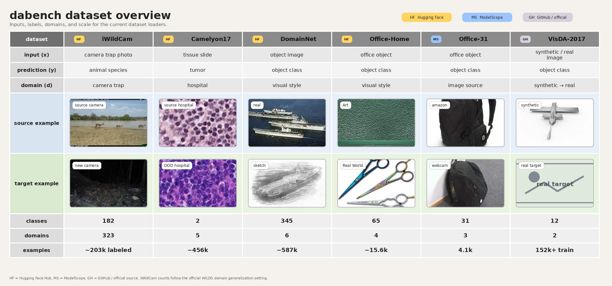

# Datasets

`dabench` provides lightweight loaders for domain adaptation datasets. Loaders take a local dataset path and return a native 🤗 Hugging Face [`datasets.Dataset`](https://huggingface.co/docs/datasets) whenever possible, so the result can be used with `map`, `filter`, `set_transform`, `transformers.Trainer`, or custom PyTorch code.

## Supported datasets



| Dataset | Homepage | Domains / splits |
| --- | --- | --- |
| DomainNet | 🤗 [wltjr1007/DomainNet](https://huggingface.co/datasets/wltjr1007/DomainNet) | `clipart`, `infograph`, `painting`, `quickdraw`, `real`, `sketch` |
| Office-Home | 🤗 [flwrlabs/office-home](https://huggingface.co/datasets/flwrlabs/office-home) | `Art`, `Clipart`, `Product`, `Real World` |
| Office-31 | <span class="twemoji">Ⓜ️</span> [OmniData/Office-31](https://www.modelscope.cn/datasets/OmniData/Office-31) | `amazon`, `dslr`, `webcam` |
| Camelyon17 | 🤗 [jxie/camelyon17](https://huggingface.co/datasets/jxie/camelyon17) | `id_train`, `id_val`, `unlabeled_train`, `ood_val`, `ood_test` |
| VisDA-2017 | <span class="twemoji">🐙</span> [taskcv-2017-public](https://github.com/VisionLearningGroup/taskcv-2017-public/tree/master/classification) | `train`, `validation`, `test` |
| iWildCam | 🤗 [anngrosha/iWildCam2020](https://huggingface.co/datasets/anngrosha/iWildCam2020) | Image loading is available; task-specific split/domain handling is not finalized |

## Load a dataset

```python
from dabench.datasets import load_hf_dataset

dataset = load_hf_dataset(
    "office-31",
    path="/path/to/office31",
    domains=["A"],
)
```

The returned object is a `datasets.Dataset`. For domain adaptation datasets, loaders use a small set of conventional columns when the information is available:

```text
image
label
domain
image_path
```

Some datasets expose fewer columns. For example, the prepared iWildCam dataset currently exposes only `image`.

## Download

Loading is local-only. Use `download_dataset` or the CLI to prepare data explicitly before training:

```python
from dabench.datasets import download_dataset

download_dataset(
    "office-home",
    dest="/path/to/office_home_prepared",
    source="mirror",
    proxy="disable",
)
```

Office-31 uses the ModelScope Git LFS repository and prepares a local image layout:

```bash
dabench download office-31 --dest /path/to/office31 --proxy disable
```

The same separation applies to all datasets: download once, then load from the prepared local path in experiments.

## Domains and splits

Domain filters accept full names or common abbreviations:

```python
office31 = load_hf_dataset("office-31", path="/path/to/office31", domains=["A"])
office_home = load_hf_dataset("office-home", path="/path/to/office_home", domains=["Ar"])
domainnet = load_hf_dataset("domainnet", path="/path/to/domainnet", split="train", domains=["c"])
```

Datasets with predefined splits use their native split names:

```python
camelyon17 = load_hf_dataset(
    "camelyon17",
    path="/path/to/camelyon17",
    split="id_train",
)

visda = load_hf_dataset(
    "visda-2017",
    path="/path/to/visda2017",
    split="validation",
)
```

## Preprocess images

Use `set_transform` to attach model-specific preprocessing without changing the stored dataset:

```python
dataset = load_hf_dataset("office-31", path="/path/to/office31", domains=["A"])

def transform(example):
    inputs = processor(example["image"], return_tensors="pt")
    example["pixel_values"] = inputs["pixel_values"][0]
    return example

dataset.set_transform(transform)
```

If a training loop expects a PyTorch-style dataset, wrap the Hugging Face dataset explicitly:

```python
from dabench.datasets import build_torch_dataset, get_train_transform

torch_dataset = build_torch_dataset(
    dataset,
    transform=get_train_transform(),
    domain_column="domain",
    path_column="image_path",
)
```

## Transformers Trainer

`transformers.Trainer` can consume the native dataset directly:

```python
from transformers import Trainer, TrainingArguments
from dabench.datasets import load_hf_dataset

train_dataset = load_hf_dataset("office-31", path="/path/to/office31", domains=["A"])
train_dataset.set_transform(transform)

args = TrainingArguments(
    output_dir="./outputs",
    remove_unused_columns=False,
)

trainer = Trainer(
    model=model,
    args=args,
    train_dataset=train_dataset,
    data_collator=data_collator,
)
```

For vision datasets, `remove_unused_columns=False` is often the safer default when preprocessing happens in the collator or transform. Otherwise, Trainer may remove fields such as `image`, `domain`, or `image_path` before they reach your input pipeline.

## Local data layout

Loaders read from local paths and do not start downloads implicitly. Prepare or download the dataset first, then pass the prepared path to `load_hf_dataset`.

```python
load_hf_dataset("domainnet", path="/path/to/domainnet_prepared", split="train")
load_hf_dataset("office-home", path="/path/to/office_home_prepared", split="train")
load_hf_dataset("office-31", path="/path/to/office31", domains=["A"])
load_hf_dataset("camelyon17", path="/path/to/camelyon17_prepared", split="id_train")
load_hf_dataset("visda-2017", path="/path/to/visda2017_official", split="train")
load_hf_dataset("iwildcam", path="/path/to/iwildcam_prepared", split="train")
```

Hugging Face prepared datasets should contain `dataset_info.json` and Arrow shards. Office-31 should use a local image layout with `amazon/`, `dslr/`, and `webcam/` directories. VisDA-2017 should contain the extracted official `data/` directory.
