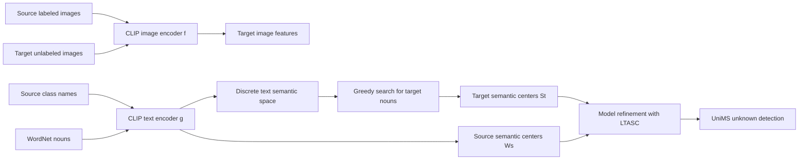

# 问题背景与核心想法

## UniDA 要解决什么

Universal Domain Adaptation, UniDA 给定：

- 有标签源域：

$$
D_s = \{(x_i^s, y_i^s)\}_{i=1}^{n_s}
$$

- 无标签目标域：

$$
D_t = \{x_i^t\}_{i=1}^{n_t}
$$

源域和目标域同时存在 domain shift 与 category shift。记源类集合、目标类集合为：

$$
C_s,\quad C_t
$$

它们可以拆成：

$$
C = C_s \cap C_t,\quad
\bar C_s = C_s \setminus C,\quad
\bar C_t = C_t \setminus C
$$

其中 `C` 是 common/shared classes，`\bar C_s` 是 source-private classes，`\bar C_t` 是 target-private classes。

UniDA 的难点是训练时不知道 `C_t`，也不知道到底属于 CDA、PDA、ODA 还是 OPDA：

| 场景 | 类别关系 | 直观含义 |
| --- | --- | --- |
| CDA | `C_s = C_t` | 闭集域适应 |
| PDA | `C_t subset C_s` | 源域有私有类 |
| ODA | `C_s subset C_t` | 目标域有未知类 |
| OPDA | 两边都有私有类 | 最一般、最难 |

最终目标是：target common 样本要被分到正确已知类；target-private 样本如果存在，要被统一识别为 unknown。

## 传统聚类式 UniDA 的核心假设

很多 UniDA 方法先获得两类语义中心：

- 源域语义中心：通常由源样本特征或源类别原型得到。
- 目标域语义中心：通常由 target 特征做 K-means、OT 或其他聚类得到。

然后用中心之间的相似度判断哪些 target clusters / target samples 是 common，哪些是 unknown。

这条路线的问题在于两个假设很脆弱：

1. **target semantic centers 不应该有域偏置**  
   但如果中心直接来自 target image embeddings，它们会带上目标域特有风格。例如 Amazon 商品图和 Webcam 图像的特征中心，即使类别相同，也可能因为域差异而距离变远。

2. **target cluster 数量应该可估计**  
   UniDA 不知道目标域有哪些类。连续图像空间中的聚类中心语义粒度不受约束，可能把同一类拆成多个细粒度簇，也可能把语义相近的类合并，因此 `K` 很难可靠估计。

论文图 1 的左侧就是这个问题：连续空间中的语义中心会逐渐偏向某个域，并且语义粒度不可控。

## TASC 的核心转向：在文本表示空间找中心

TASC 的想法是：不要直接在连续图像特征空间里学 target prototypes，而是在 CLIP 的文本表示空间里找 target semantic centers。

CLIP 有图像编码器 `f` 和文本编码器 `g`。给定图像 `x` 和类别名 `t_j`：

$$
z = f(x),\quad s_j = g(t_j)
$$

图像属于类别 `j` 的概率由图文相似度 softmax 得到：

$$
p_i = P(s_i \mid z; \tau)
=
\frac{\exp(\operatorname{sim}(z, s_i) / \tau)}
{\sum_{j=1}^{m}\exp(\operatorname{sim}(z, s_j) / \tau)}
$$

TASC 把源域类别名编码成源语义中心：

$$
W_s = [w_1^s, w_2^s, \ldots, w_{|C_s|}^s],
\quad w_j^s = g(t_j^s)
$$

对于目标域，训练时没有目标类别名，因此从下面的离散集合中搜索：

$$
T^s \cup T^{nouns}
$$

其中 `T^s` 是源类名，`T^{nouns}` 是 WordNet 中的 noun 集合。搜索出的文本 embedding 作为 target semantic centers。

## 为什么文本空间更适合 UniDA

TASC 依赖两个判断：

1. **文本 embedding 更少域偏置**  
   类别名 `keyboard`、`bike`、`mug` 的文本 embedding 不属于 Amazon、Webcam 或 Clipart 中任何一个视觉域。它天然更接近类别语义，而不是具体拍摄风格。

2. **离散 noun 空间限制语义粒度**  
   连续空间中任何点都可以成为中心；文本空间中只能选一个明确 noun 或源类名。这个约束降低了过拟合 target 图像分布的风险，也让“保留/丢弃多少中心”成为可搜索的问题。

因此，TASC 不是单纯换了 backbone，而是把 UniDA 中最脆弱的“语义中心学习”改写成了一个离散语义搜索问题。

## 方法整体流程

代码里这条流程主要分布在：

- [`train_sapphire_TASC.py`](../codes/TASC/train_sapphire_TASC.py)：TASC 的搜索、训练、推理逻辑。
- [`train_sapphire_TASCBase.py`](../codes/TASC/train_sapphire_TASCBase.py)：抽取 target features、编码 WordNet nouns、文本 prompt 处理。
- [`train_sapphire_CLIPLoRABase.py`](../codes/TASC/train_sapphire_CLIPLoRABase.py)：构建 CLIP、LoRA、数据加载和训练循环。

