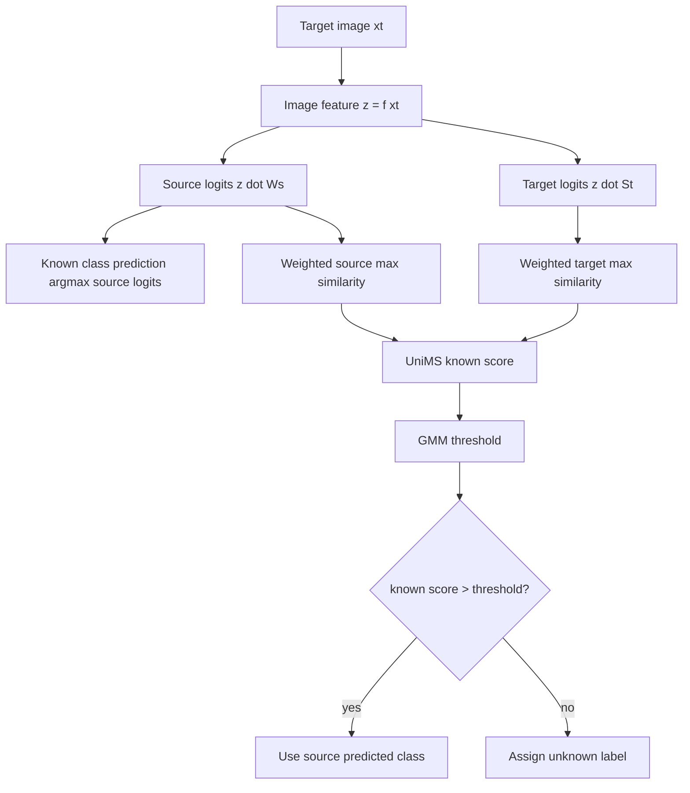

# UniMS 与推理阶段

训练之后，模型仍然需要在推理时决定一个 target 样本是已知 common 类，还是 target-private unknown 类。TASC 为此提出 Universal Maximum Similarity, UniMS。

## 1. 先建立两套语义中心

推理前，代码会调用 `init_text_embeddings()`，得到两套文本中心：

$$
W_s = [w_1^s,\ldots,w_{|C_s|}^s]
$$

$$
S_t = [s_1^t,\ldots,s_K^t]
$$

其中 `W_s` 来自源类名，`S_t` 来自第一阶段搜索出的 target nouns。

代码位置：[`train_sapphire_TASC.py`](../codes/TASC/train_sapphire_TASC.py)

```python
self.text_features = self.embed_classnames(self.classnames_split['source'], need_token=False)
self.text_features_target = self.embed_classnames(self.discovered_classnames, need_token=False)
```

## 2. 用文本中心互相分类，估计类别偏移

TASC 的关键观察是：如果一个源类是 common，那么它的源文本 embedding 应该能被 target semantic centers 明确分类；如果一个 target noun 是 target-private，它相对于源类名会更不确定。

因此定义两个归一化熵向量：

$$
ent_i^s
=
\frac{
\operatorname{Entropy}(h(w_i^s; S_t, \tau))
}{\log K}
$$

$$
ent_j^t
=
\frac{
\operatorname{Entropy}(h(s_j^t; W_s, \tau))
}{\log |C_s|}
$$

直观解释：

- `ent_i^s` 低：源类 `i` 能明确匹配某个 target center，更像 common source class。
- `ent_j^t` 高：target center `j` 很难被源类中心解释，更像 target-private center。

代码：

```python
t2s_logits = self.text_features_target @ self.text_features.T / self.text_temp
s2t_logits = self.text_features @ self.text_features_target.T / self.text_temp
self.t2s_prob = F.softmax(t2s_logits, dim=1)
self.s2t_prob = F.softmax(s2t_logits, dim=1)
self.t2s_ent = (-self.t2s_prob*self.t2s_prob.log()).sum(dim=1) / log(self.t2s_prob.size(1))
self.s2t_ent = (-self.s2t_prob*self.s2t_prob.log()).sum(dim=1) / log(self.s2t_prob.size(1))
```

注意变量名：

- `s2t_ent` 对应源中心相对于 target centers 的熵，即论文里的 `ent^s`。
- `t2s_ent` 对应 target centers 相对于源中心的熵，即论文里的 `ent^t`。

## 3. UniMS 公式

给定 target image `x^t`，TASC 定义：

$$
\operatorname{UniMS}(x^t)
=
\max_i
\left[
(1 - ent_i^s)\operatorname{sim}(f(x^t), w_i^s)
\right]
-
\max_j
\left[
ent_j^t \operatorname{sim}(f(x^t), s_j^t)
\right]
$$

第一项是 weighted source maximum similarity：

$$
MS_s^{ent}
=
\max_i
\left[
(1 - ent_i^s)\operatorname{sim}(f(x^t), w_i^s)
\right]
$$

第二项是 weighted target-private tendency：

$$
MS_t^{ent}
=
\max_j
\left[
ent_j^t\operatorname{sim}(f(x^t), s_j^t)
\right]
$$

所以：

$$
UniMS = MS_s^{ent} - MS_t^{ent}
$$

直观判断：

- 如果样本靠近一个低熵源类中心，第一项大，UniMS 高，更可能是 known。
- 如果样本靠近一个高熵 target center，第二项大，UniMS 低，更可能是 unknown。

代码中 `get_unknown_scores()` 返回的是 unknown score 字典；最终 `known_scores = -unknown_score_dict['UniMS']` 再在 trainer 里取负号使用：

```python
unknown_scores_dict['UniMS'] = \
    torch.max(logits_cluster*t2s_ent.unsqueeze(0), dim=1)[0] - \
    torch.max(logits*(1 - s2t_ent).unsqueeze(0), dim=1)[0]

results['known_scores'] = -unknown_score_dict['UniMS']
```

等价于论文的 `UniMS` 越大越 known；代码先构造 “越大越 unknown” 的分数，再取负变成 known score。

## 4. GMM 自适应阈值

推理时不能手调阈值，因为 UniDA 类别偏移不确定。TASC 用 2-component Gaussian Mixture Model 拟合 known score 分布，再取阈值。

代码入口在 `TASCTrainer.test()`：

```python
known_scores = (known_scores - known_scores.min()) / (known_scores.max() - known_scores.min())
weights_init = np.array([self.model.estimated_shared,
                         self.model.num_clusters - self.model.estimated_shared])
weights_init = weights_init / weights_init.sum()
thr = gmm_threshold(known_scores, weights_init, self.model.fixed_weights, ...)
known_mask = known_scores > thr
predict_labels[~known_mask] = self.info.num_classes
```

其中：

- `estimated_shared` 是搜索结束后源类名位置被保留下来的数量。
- `num_clusters - estimated_shared` 近似 target-private cluster 数。
- `fixed_weights=True` 时，GMM 初始化或拟合时会使用这个估计比例。

论文中也强调：TASC 通过搜索出的 `r` 估计 target-private 类比例，然后给 GMM 阈值提供先验，这比纯手动阈值更稳。

## 5. 最终预测流程



这里有一个容易忽略的设计：最终 known class label 来自源类分类器 `W_s`，不是 target cluster label。target centers 主要用于目标域聚类训练和 unknown detection；对 known 类分类仍然依赖源类名集合。

## 6. 评估指标

代码中主要评估：

- Closed-set OA / Recall：只看 target shared 样本的分类。
- Open-set OS*：target shared 类平均准确率。
- UNK：target-private 作为 unknown 的召回率。
- H-score：

$$
H =
\frac{2 \cdot OS^* \cdot UNK}{OS^* + UNK}
$$

- NMI：target-private 内部聚类质量。
- AUROC / AUPR：known vs unknown 二分类分数质量。
- UCR / OSCR：同时考虑 known 分类正确性和 unknown 拒识质量。

代码位置：

- [`TASCTrainer.test`](../codes/TASC/train_sapphire_TASC.py)
- [`CLIPLoRABaseTrainer.evaluate`](../codes/TASC/train_sapphire_CLIPLoRABase.py)
- [`sapphire/test/evaluator.py`](../codes/TASC/sapphire/test/evaluator.py)

