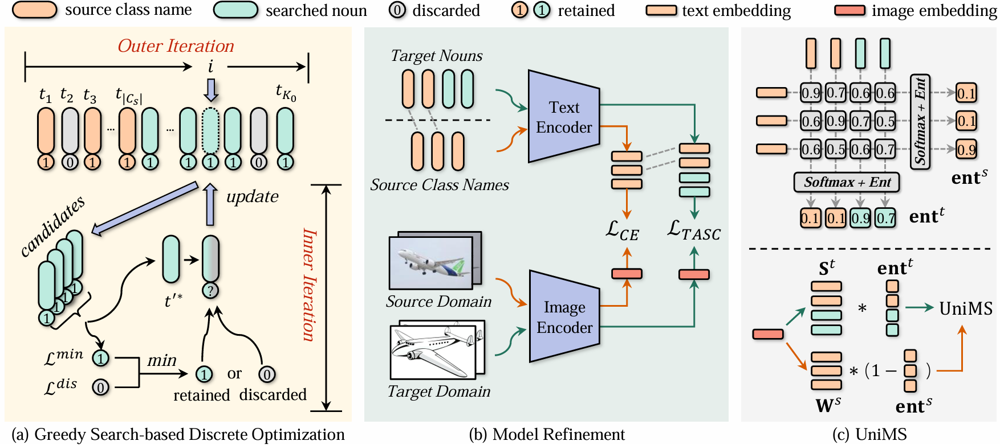

# TASC 论文与代码精读

本文档面向继续研究 TASC / UniDA 的读者，目标不是复述摘要，而是把论文的核心问题、方法公式、实现细节和可继续改进的位置串起来。

论文：**Target Semantics Clustering via Text Representations for Robust Universal Domain Adaptation**，AAAI 2025。  
本地 PDF：[`../He 等 - Target Semantics Clustering via Text Representations for Robust Universal Domain Adaptation.pdf`](../He%20等%20-%20Target%20Semantics%20Clustering%20via%20Text%20Representations%20for%20Robust%20Universal%20Domain%20Adaptation.pdf)  
本地代码主目录：[`../codes/TASC`](../codes/TASC)

## 阅读顺序

1. [问题背景与核心想法](01_problem_and_core_idea.md)  
   解释 UniDA、类别偏移设定、为什么已有聚类式方法不稳，以及 TASC 为什么转向文本表示空间。

2. [TASC 方法主体](02_tasc_method.md)  
   详细推导目标函数、信息最大化、离散语义搜索、模型微调，并给出论文公式与代码实现的逐项对应。

3. [UniMS 与推理阶段](03_unims_and_inference.md)  
   解释未知类检测分数 UniMS、熵权重、GMM 阈值、评估指标和实现细节。

4. [代码结构与运行链路](04_code_walkthrough.md)  
   从 `train_sapphire.py` 到 `TASC.forward()`、`greedy_search()`、数据集划分和 LoRA 模块，按执行顺序读代码。

5. [实验结论、局限与研究切入点](05_experiments_and_research_notes.md)  
   总结论文实验结论，并列出适合后续研究的切入点，包括搜索空间、目标函数、阈值建模和扩展到新任务。

## 方法总览图

上图来自代码仓库的 `image.png`。它把方法分成三块：

- 左：冻结 CLIP 编码器，在离散文本语义空间中贪心搜索 target semantic centers。
- 中：固定搜索出的 target nouns，通过源域交叉熵和目标域信息最大化微调 LoRA。
- 右：用源语义中心、目标语义中心之间的类别偏移信息构造 UniMS，推理时检测 unknown。

## 一句话主线

TASC 的关键判断是：UniDA 的困难不只是 domain shift，而是 common class detection。已有方法在连续图像特征空间里学习 target prototypes，容易有域偏置，也不知道该聚多少类。TASC 改为在 WordNet nouns 加源类名构成的离散文本表示空间中搜索目标语义中心，让 common 类更容易用相似度匹配，让 target-private 类更容易以文本语义中心聚类，再用 UniMS 做 unknown 检测。

